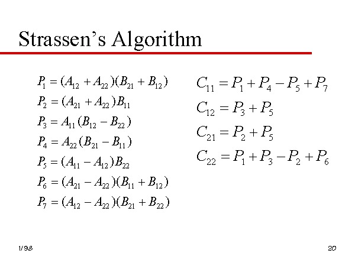

# Chapitre 3 : Récursivité

## 1. Principe

### 1.Définition

Une **fonction récursive** est une fonction dont la définition se décompose en 2 cas :

- Un cas de base, sur des entrées élémentaires, qui est traité directement.
- Un cas récursif, qui fait appel à cette même fonction, sur des entrées **différentes** plus simple à traiter (c'est à dire plus proches d'un cas de base).

_Exemple 1_

```pseudocode
fonction Factorielle (n: entier):
    Si n <= 1:
        retourner 1
    Sinon
        retourner n * Factorielle(n - 1)
```

Version récursive terminale

```pseudocode
fonction FactAux(res: entier, n: entier):
    Si n <= 1:
       retourner res
    Sinon
        retourner FactAux(n * res, n - 1)
```

Une fonction est récusrive **terminale** si elle fait un seul appel récursive, et aucune opération **après** cet appel (l'appel récursif est la dernière instruction à exécuter).

Dans ce cas, pas besoin de pile de récursion.x²

_Exemple 2_

Tours de Hanoï

```pseudocode
fonction hanoi(n, départ, milieu, arrivée):
    Si n >= 1:
        hanoi(n-1, départ, arrivée, milieu)
        déplacer(départ, arrivée)
        hanoi(n-1, milieu, départ, arrivée)
```

## 2. Calcul de complexité

Une fonction récursive s'écrit dans sa forme générale comme suit.

```pseudocode
fonction f(x: entree):
    # Si x vérifie cas de base -> retourner h0(x)
    x1 <- g1(x)
    x2 <- g2(x)
    xr <- ge(x)

    y1 <- f(xn)
    yr <- f(xr)

    retourner h(y1, ..., yr)
```

où $g_1, ..., g_r, h$ sont des fonctions définies en dehors de $f$.

Notons $C(X)$ le coût d'un appel à $f(X)$

Alors

$C(X) =$ coût interne + $\sum_{i=0}^r C(X_i)$

$C$(cas de base) $=$ coût de $h_0$

### Application

Soit $C(n)$ le coût de Hanoi(n, ...)

On a alors :

$C(0) = 0$

$C(n) = 1 + 2 C(n-1)$

| $n$ | $C(n)$ |
| --- | ------ |
| 0   | 0      |
| 1   | 1      |
| 2   | 3      |
| 3   | 7      |
| 4   | 15     |
| 5   | 31     |
| 6   | 63     |

La complexité de Hanoi est donc $\theta(2^n)$ : c'est **exponetiel**

### Master Theorem

Bien, souvent, le coût d'une fonction récursive s'écrit sous forme :

$C(n) = f(n) + a.C(n/b)$

$C(0) = \theta(1)$

On a alors 3 régimes possibles :

#### 1. La récursion est plus coûteuse

Si $log_b(a) > d$, on a :

$C(n) = \theta(n^{log_b(a)})$

#### 2. Les coûts sont équilibrés

Si $log_b(a) = d$, on a :

$C(n) = \theta(f(n).log(n))$

#### 3. Le coût interne domine

Si $log_b(a) < d$, on a :

$C(n) = \theta(f(n))$

## 3. Diviser pour (mieux) régner

Pour résoudre un problème $P$ sur ue entrée $X$, on déccoupe $X$ en une entrées de taille $\frac{|X|}{b}$, on résout récursivemet $P$ sur $a$ combinaisons, de ces entrées, puis con "recolle" les $a$ solutions ainsi obtenues.

_Exemple_

Le tri fusion

```pseudocode
fonction triFusion(list: Liste):
    Si taille(lst) <= 1:
        retourner lst
    Sinon:
        l1, l2 <- Diviser(lst) # θ(n)
        # |l1| = n/2 # |l2| = n/2
        y1 <- triFusion(l1) # C(n/2)
        y2 <- triFusion(l2) # C(n/2)
        retourner Fusion(y1, y2) # θ(n)
```

_Exercice 1_

Ecrire les foctions Diviser et Fusion, de sorte que leur coût soit $\theta(n)$ sur une entrée de taille $n$.

Soit $C(n)$ le coût de triFusion(lst) avec $|lst| = n$

$C(1) = C(0) = \theta(1)$

$C(n) = \theta(n)$ _Coût interne_

$\rightarrow$ Master Theorem

On a $C(n) = \theta(n^d) + a.C(\frac{n}{b})$ avec :

$a = b = 2$

$d = 1 \rightarrow log_b(a) = log_2(2) = 1 = d$

Le cas **2** s'applique $\rightarrow C(n) = \theta(n.log(n))$

_Exercice 2_

Algorithme de Strassen (Multiplication de matrices)

$A = \begin{pmatrix}
A_1 & A_2 \\
A_3 & A_4
\end{pmatrix}$

$B = \begin{pmatrix}
B_1 & B_2 \\
B_3 & B_4
\end{pmatrix}$

$C = A.B = \begin{pmatrix}
A_1B_1 + A_2B_3 & A_1B_2 + A_2B_4 \\
A_3B_1 + A_4B_3 & A_3B_2 + A_4B_4
\end{pmatrix}$

Soit $T(n)$ le coût des produit par bloc $\frac{n}{2}.\frac{n}{2}$ de 2 matrices $n.n$

$T(n) = \theta(n^2) + 8.T(\frac{n}{2})$

$MT \rightarrow log_b(a) = log_2(8) = 3 > d$

$=>$ cas **3** $T(n) = \theta(n^{log_2(a)}) = \theta(n^3)$

$C = A.B = \begin{pmatrix}
C_1 & C_2 \\
C_3 & C_4
\end{pmatrix}$



On a maintenant

$T(n) = \theta(n^2) + 7 . T(\frac{n}{2})$

$MT \rightarrow$ **1** :

$T(n) = \theta(n^{log_b(a)})$

$T(n) = \theta(n^{log_2(7)})$

$T(n) = \theta(n^{2,807...})$
