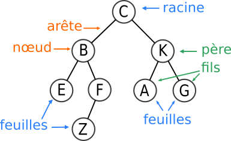
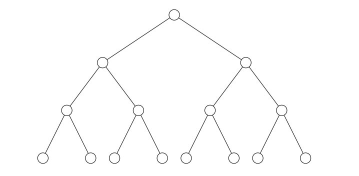
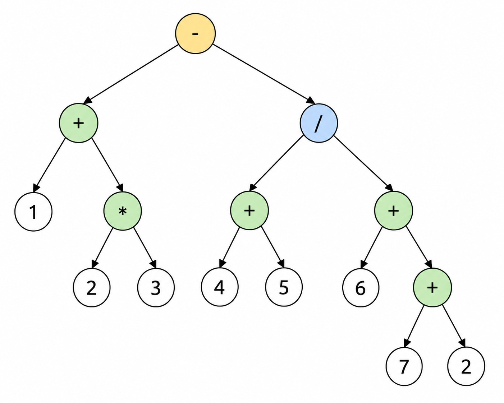
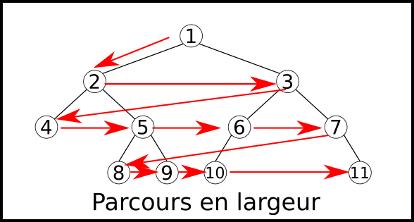
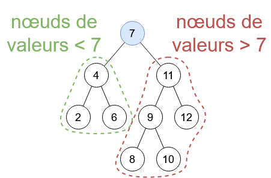

# Chapitre 4 : Arbres

## 1. Définition et algos de base

Un arbre se construit récursivement comme suit :

Un arbre est un **noeud** (une unité mémoire) ayant un **contenu** (ou y stocke de l'information), et ayant une liste d'**enfant**, eux-mêmes des arbres (donc des noeuds).

Un noeud ayant une liste d'enfants vide est appelé une **feuille** / **noeud termial**.

### Exemple

Explorateur de fichiers, arbre généalogique\_

### Remarque

En théorie des graphes, un arbre est un graphe **connexe sans cycle**.

### Vocabulaire

- La **taille** d'un arbre est son nombre de noeuds
- Une **branche** est un chemin de la racine à une feuille
- La **hauteur** est la longueur max d'une branche (arrêtes)
- La **profondeur** d'un noeud est sa distance à la racine

Donc **hauteur** $=$ **profondeur maximale**

La **profondeur de la racine** vaut $0$ !

### Algorithmes

#### Hauteur

    hauteur(A: arbre)
        Si A n'a pas d'enfant:
            retourner 0
        h <- 0
        Pour tout enfant B de A:
            h <- max(h, hauteur(B))
        retourner 1 + h

## 2. Arbre binaires

Un arbire binaire est **soit vide**, soit un a un noeud avec **2 enfants**.

### Structure

    structure ArbreBin:
        valeur: type interne
        filsGauche (FG): ArbreBin
        filsDroi (FD): ArbreBin

- Un arbre biaire est **complet** si toutes ses feuilles ont la même profondeur. Dans ce cas, sa **taille** est $n = 2^{h+1} -1$ où $h$ est sa hauteur.

- En général (pas complet), on a $n \le 2^{h+1} - 1$.

- Un arbre binaire est **localement complet** si tous ses noeuds ont 2 fils **non-vides**.

_Exemple : les expressions arithmétiques ont ue structure d'arbre biaire localement complet._

$$(1+(2*3))-(4+5)/(6+(7+2))$$

## 3. Algos sur les arbres

### Parcours en profondeur

#### Algo parcours profondeur

    ParcoursProf(A: arbre)
        Afficher(A.valeur)
        Pour chaque enfant B de A:
            ParcoursProf(B)

Pour les arbres binaires, on distingue 3 types de parcours en profondeur :

- **préfixe :** on traite le noeud courant **avant** ses enfants
- **postfixe :** on traite le noeud courant **après** ses enfants
- **infixe :** on traite le noeud courant **entre ses 2 enfants**

#### Algo parcours profondeur infixe

    ParcoursInfixe(A: arbre)
        Si non vide:
            ParcoursInfixe(A.FG)
            Afficher(A.val)
            ParcoursInfixe(A.FD)

On fait un parcours en profondeur **infixe** pour les opérations arithmétiques, car on lit (3+5).

### Parcours en largeur

On veut parcourir les noeuds de gauche à droite, puis de haut en bas ("tranche par tranche").

On va utiliser une structure de **file** (liste chaînée où l'ajout se fait à la fin et la suppression au début).

#### Algo parcours largeur

    ParcoursLargeur(A: arbre)
        F <- file vide
        Ajouter A à F
        Tant que F non vide:
            B <- Extraire tête de F
            Pour tout fils B' de B:
                Ajouter B' à la fin de F
            Afficher B

## 4. Arbres binaires de rechercher (ABR)

Il s'agit d'une version améliorée des listes triées. Une structure arborescente qui maintient un ordre entre les éléments qu'elle contient.

Un arbre binaire A est un **ABR** si, pour tout noeud $X$ de A, sa valeur est **supérieure ou égale** à toutes celles contenues dans $X.FG$ et **strictement inférieure** à celles dans $X.FD$.

Un parcours **infixe** d'un ABR donne la liste de ses valeurs dans l'ordre croissant

La recherche se fait de façon efficace dans un ABR : il n'y a besoin de visiter qu'une seule branche.

### Algo

    Recherche(A: ABR, x: valeur):
        Si A.val = x:
            retourner Vrai
        Si A.val > x:
            Recherche(A.FG, x)
        Si A.val < x:
            Recherche(A.FD, x)

L'algo Recherche visite les noeuds d'une seule branche. Le coût associé à chaque noeud (coût interne de la fonction) est $O(1)$.

Donc sa complexité est $O(hauteur(A))$.

Donc si $A$ est complet, et de taille $n$, sa complexité est donc $O(log(n))$ :

En revanche, s'il est très déséquilibré (ex : une seule longue branche), cette complexité devient $O(n)$

L'insertion se fait en ajoutant une nouvelle feuille à la fin de la branche sur laquelle o aurait fait la recherche.

### Fonction insérer

    Insert(A: ABR, x: valeur):
        Si a est vide:
            retourner ArbreBin(x)
        Si A.val >= x:
            A.FG <- Insert(A.FG, x)
            retourner A
        Sinon:
            A.FD <- Insert(A.FD, x)
            retourner A

## 5. AVL (ABR équilibré)

Un AVL est un ABR qui vérifie une conrainte d'équilibre :

Pour chaque noeud interne $X$ :

$$hauteur(X.FG) - hauteur(X.FD) \le 1$$

Pour convention : $hauteur(vide) = -1$

### Théorème

Pour tout AVL $A$ de taille $n$, $hauteur(A) = \theta(log(n))$

## TD4 essaies

### Exercice 1

#### 1.

    taille(A: Arbre):
        Si A.nbFils == 0:
            retourner 0
        acc <- A.nbFils
        Pour chaque enfant B de A:
            acc <- acc + taille(B)
        retourner acc

#### 2.

    valeurMax(A: Arbre):
        Si A.nbFils == 0:
            retourner A.valeur
        vMax <- A.valeur
        Pour chaque enfant B de A:
            vMax <- max(vMax, valeurMax(B))
        retourner vMax

#### 3.

    sommeElement(A: Arbre):
        Si A.nbFils == 0:
            retourner A.valeur
        somme <- A.valeur
        Pour chaque enfant B de A:
            somme <- somme + sommeElement(B)
        retourner somme

#### 4.

    distanceMinimaleFA(A: Arbre):
        Si A.nbFils == 0:
            retourner 0
        h <- Infini
        Pour chaque enfant B de A:
            h <- min(h, distanceMinimaleFA(B))
        retourner 1 + h
