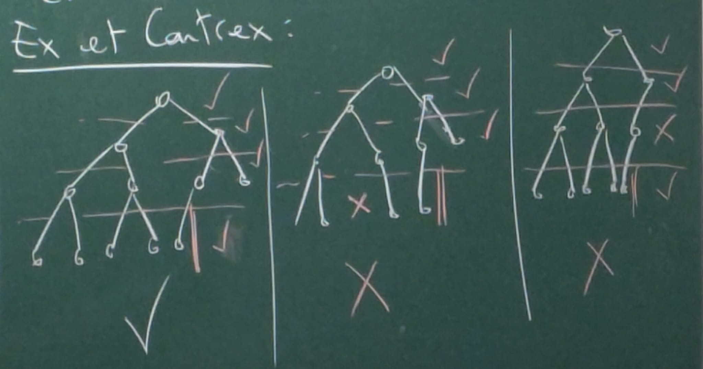
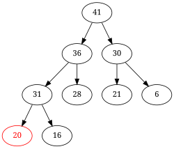
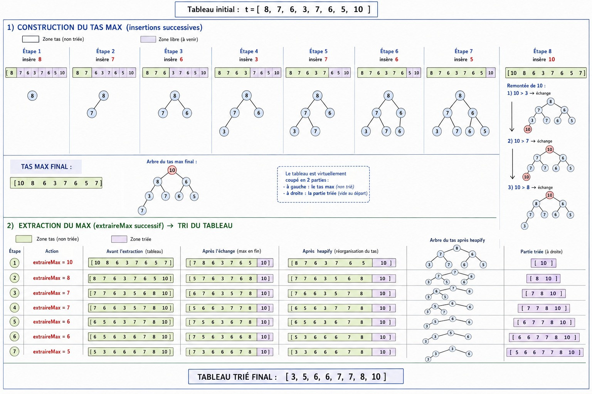

# 5. Tas

## 1. Motivation

Pour trier une liste de $n$ élèments, une approche élémentaire consiste à en extraire répétitivement l'élément que l'on insère dans une nouvelle liste. C'est le **tri par sélection**.

### Algo tri par sélection

    triSelect(lst: listeChainee):
        res <- liste vide
        Tant que lst non vide:
            x <- ExtraireMax(lst)
            Ajouter x <- en tête de res
        retourner res

Coût de `ExtraireMax(lst)` $\rightarrow \theta(len(lst))$

Coût $\theta(n^2)$ avec `ExtraireMax` en $\theta(n)$ (on ne peut pas faire mieux sur les listes non-triés).

### But

Concevoir une structure permettant l'opération `ExtraireMax` avec une meilleure complexité.

## 2. Arbres binaires parfaits

C'est la meilleure approximation possible d'un arbre linéaire complet, quand la taille $n$ est quelconque.

Un arbire binaire est **parfait** si tous ses niveaux sauf peut-être le dernier sont **entièrement remplis** (il y a doc 2 éléments à profondeur $i$ pour tout $i < hauteur(A)$), et le dernier est **contigu** en partant de la gauche (pas de trou).

### Exemple & Contre-exemple



On peut représenter sans ambiguité un ABP (arbre binaire parfait) à l'ordre d'un tableau, dans lequel les éléments de l'ABP sont rangés selon les parcours en largeur.

En gros on rempli toutes les niveaux complètement, sauf éventuellement le dernier niveau, mais ils sont à gauches.

Ainsi, on peut représenter un ABP dans un tableau, et ségmenter les niveaux `|` naturellement :

`1 | 2  3 | 4  5  6  7 | 8  9  10  11  ...`

`1` est à la racine (niveau 0), `2` et `3` les enfants de `1` (niveau 1)

Premier indice de chaque niveau :

- Niveau 0 : $2^0 - 1$
- Niveau 1 : $2^1 - 1$
- Niveau 2 : $2^2 - 1$
- Niveau $n$ : $2^n - 1$

## 3. Tas max

Un tas max est un ABP dans lequel les éléments vérifiant la règle suivante :

- Tout noeud a une valeur $>$ à celles de ses fils



La règle d'organisation interne des tas max impose que le **maximum se trouve toujours à la racine.**

$\rightarrow$ On peut y accéder en temps $0(1)$.

$\rightarrow$ On peut l'extraire en temps $0(log(n))$ avec l'algo suivant :

### Algo ExtraireMAx

    ExtraireMax(t: tasMax):
        n <- taille(t)
        Echanger(t, 0, n-1)
        i <- 0
        Tant que t[i] n'est pas + grand que ses 2 fils:
            j <- indice du plus grand fils
            Echanger(t, i, j)
            i <- j
        Supprimer(t[n-1])

$\rightarrow$ Complexité : $O(hauteur(t)) = O(log(n))$

$\rightarrow$ Et l'insertion ?


Si on veut rajouter `38` ?

On insère le noeud `38` au dernier emplacement valide (dernier niveau à droite). Puis on permute avec son popa.

### Algo Insert

    Insert(t: tasMax, x: valeur):
        n <- taille(t)
        t[n] <- x
        # On insère à la fin du tableau
        i <- n
        Tant que i > 0 et t[i] > t[popa(i)]:
            Echanger(t, i, popa(i))
            i <- popa(i)

$\rightarrow$ Complexité : $O(hauteur(t)) = O(log(n))$

En gros on vérifie que l'enfant insérer et plus grand que son popa, si oui, on le **permute** avec lui en boucle et met à jour son indice $i$ avec le nouvel, quand il est plus petit que son popa, on s'arrête et on garde la structure du Tas max.

### Tri par insertion

Le tri par insertion avec un tas max (appelé **tri par tas**) se fait en 2 temps.

$\rightarrow$ On vide la structure en entrée dans un tas max construit par insertions successives (coût $O(log(n))$).

$\rightarrow$ On vide ce tas max dans la structure d'output (liste / tableau), par `ExtraireMax` successifs (coût $O(log(n))$).

#### Observation

Ces opérations poeuvent se faire en place au sein d'un unique tableau $t$ de taille $n$, virtuellement coupé en 2. Le début contient le tas max, et la fin contient le reste des éléments (montrés initialement, puis triés dans un second temps).

#### Exemple tri du tableau

`t = [ | 8 7 6 3 7 6 5 10 ]`

Insert(t, 8)

`t = [ 8 | 7 6 3 7 6 5 10 ]`

Insert(t, 7)

`t = [ 8 7 | 6 3 7 6 5 10 ]`

...

Insert(t, 10)

`t = [ 8 7 6 3 7 6 5 10 | ]`

- On échange le `10` avec le `3` (niveau 2)
- On échange le `10` avec le `7` (niveau 1)
- On échange le `10` avec le `8` (niveau 0)



## 4. Construire un tas max

La costruction de "haut en bas" (par insertion successives), d'une tas de taille $n$ coûte $O(log(n))$ (atteint dans le pire cas).

Une approche de "bas en haut" permet de faire chûter cette complexité à $O(n)$.

`t = [ | 3 6 5 7 8 2 3 4 ]`

### Algo

```
Tamiser(t: ABP, i: indice, n: entier):
    // Le sous arbre A en enraciné en t[i] est tel que
    // A.FG est un tas max
    // A.FD est un tas max
    // But --> A est un tas max à la fin
    // t est un ABP de taille n

    Tant que i < n et (t[i] < t[FG(i)] ou t[i] < t[FD(i)])
    j <- indiceMax(t, FG(i), FD(i))
    Echanger(t, i, j)
    i <- j
```

    CréerTas(t: tableau de taille n):
        Pour i de n-1 à 0:
            Tamiser(t, i, n)

Le coût de `Tamiser` sur un sous-arbre de hauteur $h$ est $O(h)$.

`CréerTas` fait appel à `Tamiser` sur un $2^{hauteur(t) - h}$ arbre de hauteur $h$, pour $h$ de 0 à $hauteur(t)$

$\rightarrow$ Coût total

$$\sum_{h=0}^{log(n)} 2^{log(n) - h} * O(h) = O(n \sum_{h=0}^{log(n)} \frac{h}{2^h})$$
