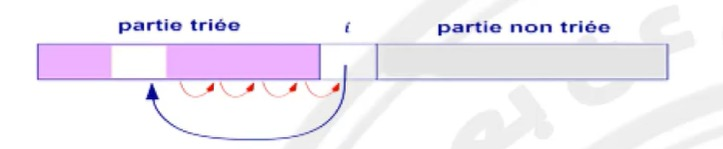
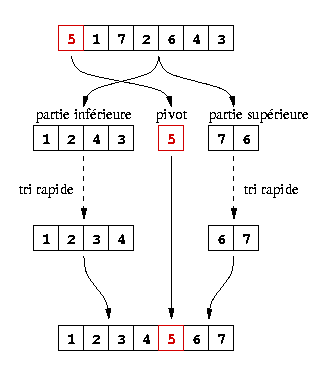

# 6. Les tris

| Algo de tri           | 😡 Pire cas       | 😐 En moyenne     | 🤩 Cas trié       | en place | stable |
| --------------------- | ----------------- | ----------------- | ----------------- | -------- | ------ |
| Tri par sélection     | $\Theta(n^2)$     | $\Theta(n^2)$     | $\Theta(n^2)$     | ✅       | ✅     |
| **Tri par insertion** | $\Theta(n^2)$     | $\Theta(n^2)$     | $\Theta(n)$       | ✅       | ✅     |
| Tri par fusion        | $\Theta(nlog(n))$ | $\Theta(nlog(n))$ | $\Theta(nlog(n))$ | ❌       | ✅     |
| **Tri rapide**        | $\Theta(n^2)$     | $\Theta(nlog(n))$ | $\Theta(n^2)$     | ✅       | ❌     |
| Tri par par ABR       | $\Theta(n^2)$     | $\Theta(nlog(n))$ | $\Theta(n^2)$     | ❌       | ❌     |
| Tri par AVL           | $\Theta(nlog(n))$ | $\Theta(nlog(n))$ | $\Theta(nlog(n))$ | ❌       | ❌     |
| Tri par tas           | $\Theta(nlog(n))$ | $\Theta(nlog(n))$ | $\Theta(nlog(n))$ | ✅       | ❌     |

**En place :** on alloue pas + de mémoire que ce qu'il a donnée en entrée (on modifie directement)

**Stable :** On échange pas l'ordre de 2 éléments égaux

## 1. Tri par insertion

### Principe

On maintient 2 moitiés dans le tableau `tab` à trier :

La première (initialement vide) est triée , et la seconde contient le reste des éléments, non triées.

On insère l'élément directement à droite de la séparation (à chaque étape), par échanges successifs avec l'élément à sa gauche, **tant que celui-ci est plus grand**.

### Algorithme

    TriInsertion(tab: tableau de taille n):
        Pour i de 1 à n-1:
            j <- i
            Tant que j > 0 et tab[j-1] > tab[j]:
                Echanger(t, j-1, j)
                j <- j-1

L'algorithme **termine** car à chaque itération de la boucle **Tant que**, $j$ est décrémenté, et la condition d'arrêt s'active lorsque $j$ devient nul.

La boucle **Tant que** termine en $\le i$ itérations (à l'étape $i$), car $j$ a été décrémenté $i$-fois et vaut $0 \rightarrow$ sortie de la boucle.

La boucle **Pour** a donc coût :

$$\sum_{i=1}^{n-1} O(i) = O( \sum_{i=1}^{n-1})=O(\frac{n(n-1)}{2})=O(n^2)$$

$\rightarrow$ Le pire cas $\theta(n^2)$ est atteint si le tableau en entrée est **décroissant**.

$\rightarrow$ Le meilleur cas $\theta(n)$ est atteint si le tableau en entrée est **croissant (déjà trié)** (car on parcours quand même la boucle **Pour**, et sortie immédiate de la boucle **Tant que**). $\rightarrow$ Coût total $= \sum_{i=1}^{n-1} O(1) = O(n)$

#### Complexité en moyenne

On considère toutes les manières de stocker $n$ éléments données dans un tableau $t$.

$\rightarrow$ Considérons une **permutation aléatoire uniforme**

$\rightarrow$ Comptons le nombre de fois que l'algorithme fait un échange. Alors le coût de l'algo est $\theta(n+M) = \theta(n + I)$.

Avec $n$ coût du **Pour**, $M$ coût des **Tant que** dans leur ensemble et $I$ les inversions.

Dans une permutation $x_1, ..., x_n$ d'élément, une **inversion** est un couple $(i, j)$ avec $i<j$ tel que $x_i > x_j$.

Un échange de 2 éléments résout exactement une inversion de la permutation aléatoire.

Donc $M = I :=$ nombre d'inversions de la permutation.

$$E[I] = \sum_{i<j} P[(i,j)] = \sum_{i<j} \frac{1}{2} = \theta (n^2)$$

## 2. Tri rapide

### Principe

On utilise l'approche **Diviser pour Régner**.

L'algorithme s'appuie sur **un pivot** $p$ choisi arbitrairement (premier élément / élément aléatoire (...)). Puis on construit $t_{inf}$ la partie de $t$ des éléments $< p$, et $t_{sup}$, la partie $\ge p$. On trie récursivement $t_{inf}$ et $t_{sup}$, et on recolle en concaténant.

### Algorithme

    TriRapide(
        t: tableau de taille n,
        deb: indice du début,
        fin: indice du fin
    ):
        Si deb == fin:
            // <= 1 élément à trier
            retourner
        p <- t[deb]
        i <- deb + 1
        Pour j de deb + 1 à fin:
            Si t[j] < p:
                Echanger(t, i, j)
                i <- i + 1
        // Placement du pivot
        Echanger(t, deb, i - 1)
        // Appels récursifs
        TriRapide(t, deb, i - 2)
        TriRapide(t, i, fin)

### Coût

#### Meilleur & pire cas

Si $t$ est trié, le coût est $\theta (n^2)$

$$C(n) = \theta(n) + C(O) + C(n-1) = \theta( \sum^{h}_{i=1}) = \theta(n^2)$$

- Avec $\theta(n)$ le coût interne
- Avec $C (0)$ le coût de la 1ère récursion
- Avec $C(n-1)$ le coût de la 2eme récursion

#### Moyenne

En moyenne, on a $|t_{inf}| \approx \frac{n}{2}$ et $|t_{sup}| \approx \frac{n}{2}$.

Donc le coût moyen serait plutôt de l'ordre :

$$C(n) = \theta(n) + 2C(\frac{n}{2})$$

Le **Master Theorem** nous donne alors $C(n) = \theta(nlog(n))$

Calcul formel du coût moyen :

On considétaire $t$ une permutation aléatoire des élément $x_1 \le x_2 \le ... \le x_n$.

Le coût du **TriFusion** est donné par le nombre total de comparaisons faites entr eun élément et un pivot.

On observe que $x_i$ et $x_j$ (avec $i < j$) sont comparés entre eux, si et seulement si $x_i$ ou $x_j$ est le premier pivot choisi parmi $x_i, x_{i+1}, ..., x_j$.

Il y a $j-i+1$ possibilités pour ce 1er pivot (parmi $x_i, ..., x_j$), toutes équiprobables. Donc :

$P[x_i$ et $x_j]$ sont comparés $= \frac{2}{j-i+1}$

On a donc :

$E[$ #comparaison $] = \sum_{i<j} P[x_i$ et $x_j$ comparés $]$

$$\sum_{i<j} \frac{2}{j-i+1} = 2 \sum_{l=2}^n \frac{n-l}{l} \le 2n \sum_{l=1}^n \frac{1}{l}$$

Donc :

$$2n \sum_{l=1}^n \frac{1}{l} \le 1 + \int_1^n \frac{1}{n}dx = 1 + [ln(n)]^n_1 = 1 + ln(n)$$

Donc $E[$ #comparaison $] = O(nlog(n))$.

## 3. Bornes inférieure sur le coût du tri

Le coût de la recherche dichotomique est $O(log(n))$ dans le pire cas sur un ensemble de $n$ valeurs possibles, et on ne peut pas faire mieux que $log_2(n)$ en général (un adversaire peut forcer ce nombre de tentatives).

Un tri idéal peut se modéliser par une recherche dichotomique de "la bonne permutation" des $n!$ éléments données en entrées. Il y a $n'$ permutations possibles, dans cette recherche a coût au moins $log_2(n!)$ dans le pire cas.

Or $log_2(n!) > log_2((\frac{n}{2})^{\frac{n}{2}}) = \frac{n}{2} log(\frac{n}{2}) = \Omega(nlog(n))$.

## Exercices révisions

### Exercice 1

#### 1.

    composantesConnexes(G: Graphe de taille n):
        composante <- tableau de taille n
        nb_composante <- 1

        Pour i allant de 0 à n-1:
            Si composante[i] vide:
                Pour chaque sommet de parcoursProfondeur(G, i):
                    composante[sommet] <- nb_composante
                nb_composante <- nb_composante + 1

        retourner composante
