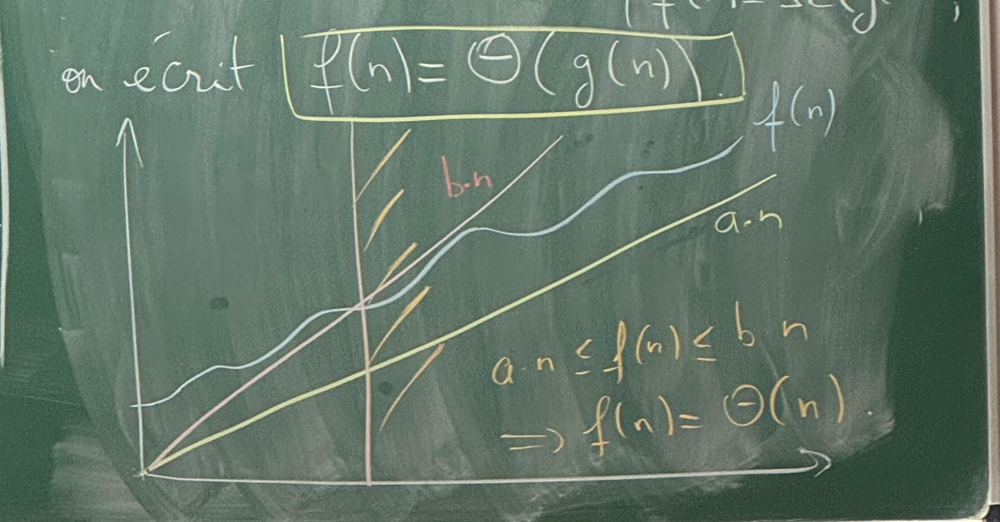

# Chapitre 1 : Complexité

$O(n)$: borne supérieur (mais ça peut être inférieur)

$\theta(n)$: borne supérieur et inférieur (ça peut pas être inférieur et supérieur)

## 1 Algorithmes, programes, efficacité

**Algorithme :** Programme formel permettant à partir de données qui lui sont passées en entrée, de produire un résultat en sortie, à l'aide d'une séquence d'instructions non-ambiguës.

_Exemple:_

- Recette de cuisine (entrée: ingrédients / sortie: plat cuisiné)
- Itinéraire GPS (entrée: position de départ, destination / sortie: liste d'instructions d'itinéraire)

En informatique, un algorithme a vocation à être implanté dans un langage de programmation (C, C++, Java, Python) qui permet de traduire les instructions haut-niveau en des séquences concrètes d'opérations machine.

$=>$ On obtient un programme

_Exemple:_

Chercher un nombre dans un tableau.

(entrée: tableau T de taille n, nombre x)

    Pour i de 0 à n-1:
        si T[i] = x:
            retourner Vrai
    retourner Faux

$=>$ Implémentation en C

```c
int find(int T[], int n, int a) {
    int i;
    for (i = 0 ; i < n ; i++) {
        if (T[i] == a) {
            return 1;
        }
    }
    return 0;
}
```

$=>$ Implémentation en Python

```py
def find(T, x):
    for y in T:
        if y == x:
            return True
    return False
```

Plusieurs questions se posent.

$=>$ Notre algorithme est-il correct ? (la valeur retournée est bien le résultat attendu)

$=>$ Termine-t-il ?

$=>$ Evaluer sa rapidité d'exécution

$=>$ Etanat donnée un problème, existe-t-il un algorithme pour le ésoudre ?

_Exemple:_

La suite de $Syracuse$

(entrée: entier $n$)

    Tant que n > 1:
        Si n est pair:
            n <- n/2
        Sinon
            n <- 3 * n + 1

Termine-t-il ?

Le problème associé à la question de la terminaison d'un programme écrit dans un langage donnée (a priori infini) sur **l'intégralité** de ses entrées possibles est **indécidable**? C'est à dire, qu'aucun algorithme ne peut répondre systématiquement à ce problème.

## 2. Complexité asymptotique

Le temps d'exécution d'un programme ne dépend de beaucoup de paramètres, souvent imprévisibles (performmances du langage de programmation utilisés, rapidité du processeur, état de la mémoire lors de l'exécution, etc.)

Donc le temps d'exécution est par nature très imprévisible. Plutôt qu'une estimation absolue de ce temps, on va chercher à en évaluer les **variations**, selon la taille des entrées : si on double la taille, est ce que le temps d'exécution

- ne change pas (coût constant)
- est "incrémente" (coût logarithmique)
- Est multiplié par une constante
  - 2 : coût linéaire
  - 4 : coût quadratique
  - $c$ : coût polynomial
- "explose" : coût exponentiel

### 2.1 Notation $O()$, $\Omega()$, $\theta()$

Dans le cadre de fonctions entières (f,g: $\N \rightarrow \N$), on écrit :

$f(n) = O(g(n))$

Si il existe $n_0\in \N$, $C\in \R$ tels que :

$f(n) \le C.g(n)$ pour tout $n \ge n_0$

_Exemple:_

$f(n) = 8n^2 + 27n + 58$
$=O(n^2)$

$C = 10, n_0 = 30$, on a bien $f(n) \le C . n^2$ si $n \ge n_0$

Observations:

- Si $f(n) = a_dn^d + a_{d-1}n^{d-1} + ... + a_0$ est un polynôme de degré $d$, alors $f(n) = O(n^d)$

- $O(f(n)) + O(g(n)) = O(f(n) + g(n))$
- $O(f(n)) * O(g(n)) = O(f(n) * g(n))$
- $O(c + f(n)) = O(f(n))$
- $\sum_{i} O(f_i(n)) = O(\sum_{i} f_i(n))$

---

Si $\exist C\in \R, n_0 \in \N$ tels que :

$f(n) \ge C . g(n)$ Pour tout $n \ge n_0$

Alors on écrit $f(n) = \Omega(g(n))$ (C'est équivalent à $g(n) = O(f(n))$)

---

Si on a à la fois :

- $f(n) = O(g(n))$
- $f(n) = \Omega(g(n))$

On écrit $f(n) = \theta(g(n))$



### 2.2 Meilleur cas, pire cas, cas moyen

La complexité asymptotique s'intéresse au coût d'un algorithme sur des entrées de **taille fixée** $n$ **arbitrairement grande** ($n \rightarrow 0$).

Mais elle peut aussi être influée par la valeur de ces entrées (pour une même taille).

Fixons une taille $n \in \N$

- **Meilleur cas:** complexité la plus faible parmi toutes les entrées possibles de taille $n$
- **Pire cas:** complexité la plus grande parmi toutes lesentrées possibles de taille $n$
- **Cas moyen:** Espérance de la complexité sur une entrée aléatoirement uniforme de taille $n$.

_Exemple:_

Tester si un tableau contient deudxd éléments, identiques.

(entrée: tableau $T$ de taille $n$)

    Pour i de 0 à n-1:
        Pour j de 0 à i-1:
            Si T[i] = T[j]:
                retourner Vrai
    retourner Faux

- **Le meilleur cas:** Si $T[0] = T[1]$ _(le meilleur cas c'est les 2 premières itations pour un tableau non-vide)_, l'algorithme fait un nombre constant d'opérations élémentaires
  - On a nombre constant de $O(1)$ ce qui donne un $O(1) = \theta(1)$
- **Pire cas:** Que des valeurs distinctes dans le tableau $T$ _(on a parcouru tous le tableau mais toutes les valeurs sont différentes)_
  - Boucle interne: $i$ itération, chacune de coût $\theta(1)=>$ Coût $\theta(i)$
  - Boucle principale: $n-1$ itération, là $i$-ème a pour coût $\theta(i)$

**Coût de la boucle:**

$= \sum_{i=1}^{n-1} \theta(i)$

$= \theta (\sum_{i=1}^{n-1} i)$

$= \theta(\frac{n(n-1)}{2})$

$= \theta(\frac{1}{2} . n^2 - \frac{1}{2}.n)$

$= \theta(n^2)$

#### Théorème

$a, b \in \N$

Soit $f$ fonction **monotone** sur $[a, b]$

Alors

$min(f(a), f(b)) + \int_{a}^{b} f(x)dx \le \sum_{i=a}^{b} f(i) \le max(f(a), f(b)) + \int_{a}^{b} f(x)dx$

#### Complexité d'un "Tant que"

1. Calculer la complexité interne (peut dépendre de l'itération en cours)
2. Identifier les **variables** dont dépend la condition de sortie $X = (x_1, x_2, ...)$
3. Calculer la valeur initiale $X_0$ de $X_1$ puis chaque valeur de $X_k$ à la fin, dela $k$-ème itration de boucle.
4. Calculer le plus petit $k$ tel que $X_k$ vérifie la condition de sortie $\rightarrow k_f$
5. Transformer la boucle
   - Tant que ($\theta(X)$) ...
   - En Pour $k$ de 1 à $k_f$ ...
