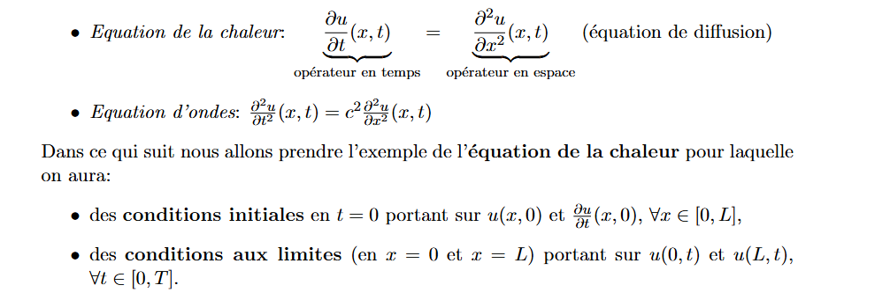
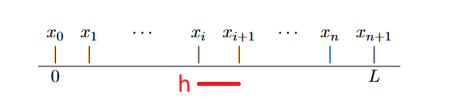
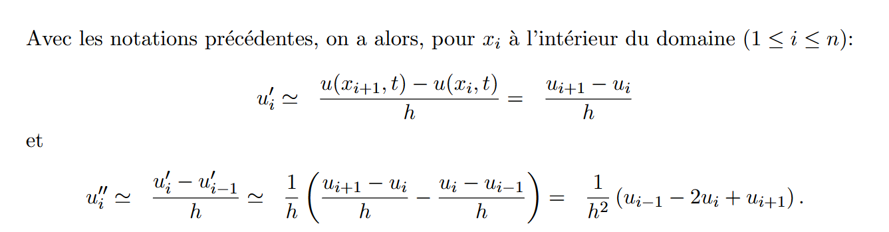
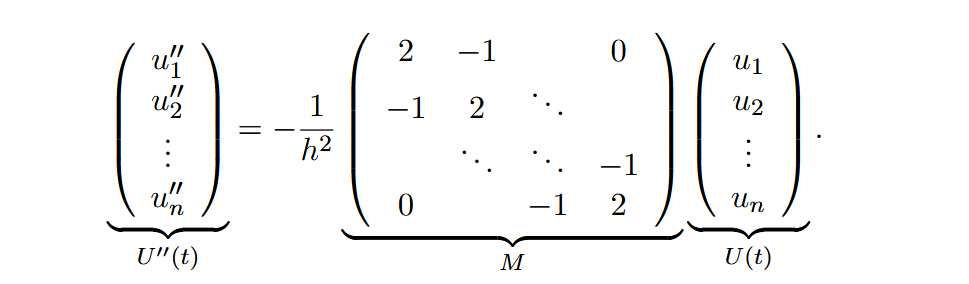
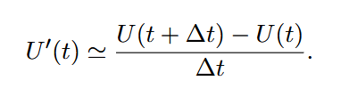
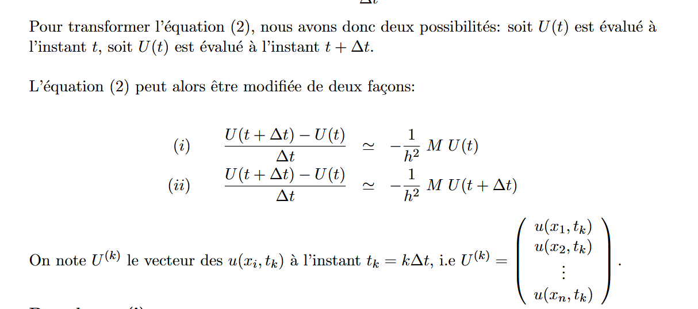
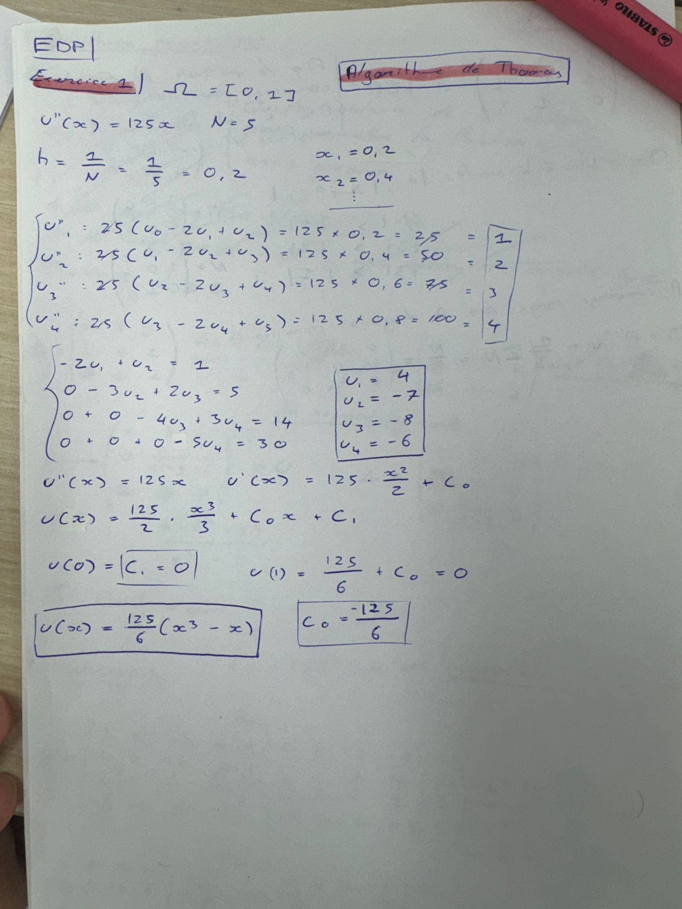

# 3. Equations aux dérivées partielles (EDP)

On souhaite résoudre un problème différentiel où l'on recherche une quantité $u(x, t)$, avec $x \in \Omega$ (domaine) et $t \in [0, T]$ (temps).

Dans ce cas, on simplifie on suppose que l'on peut se ramener à un problème de simention $1$, et que donc $\Omega = [0, L], L \in \R$.

**Exemple**

On discrétise $\Omega$ pour calculer $\frac{\partial^2u}{\partial x^2} (x, t)$ aux points de discrétisation.

Pas de discrétisation $\Omega = \frac{L}{n+1}$

On a $x_i = i*h$, $V_i \in $ {$0, ..., n+1$}

On veut calculer $\frac{\partial^2u}{\partial x^2} (x, t)$ sur les points $x_i$ (ici $t$ est fixé).

### On note

$u_i = u(x, t)$

$u'_i = \frac{\partial u}{\partial x} (x_i, t)$

$u''_i = \frac{\partial^2 u}{\partial x^2} (x_i, t)$

On va utiliser la méthode des différences finies où on estime $u'_i$ et $u''_i$ par des taux d'accroissement sur 2 points consécutifs.

### On a

$u''_i = \frac{1}{h^2}(u_{i+1} - 2u_i + u_{i-1})$

On appliquye cette formule à chaque point intérieur au domaine de discrétisation $x_1, ..., x_n$.

#### (1)

$u''_1 = \frac{1}{h^2}(u_2 - 2u_1 + u_0)$

$u''_2 = \frac{1}{h^2}(u_3 - 2u_2 + u_1)$

$...$

$u''_n = \frac{1}{h^2}(u_{n+1} - 2u_n + u_{n-1})$

On suppose $u_0 = u_{n+1} = 0$ où $u$ est nulle aux frontières du domaines. (Condition Dirichlet homogène).

### Ecriture du système (1) de façon matricielle

$$
\begin{pmatrix}
u''_1 \\
u''_2 \\
 \\
u''_n \\
\end{pmatrix}
=\frac{1}{h^2} \begin{pmatrix}
-2 & 1 &&& 0...  \\
1 & -2 & 1 && 0... \\
 \\
0 & ... & 0 & 1 & -2 \\
\end{pmatrix}
\begin{pmatrix}
u_1 \\
u_2 \\
 \\
u_n \\
\end{pmatrix}
$$

$M$ est une **matrice tridiagonale**, car il y a uniquement des $2$ sur la diagonales, et que des $-1$ sur la diagonale supérieur et inférieur.

Ainsi :

$$U''(t) = - \frac{1}{h^2}MU(t)$$

## Discrétisation de l'opération en temps $\frac{\partial u}{\partial t} (x, t)$

### On note

$U'(t)$ le vecteur $\begin{pmatrix}
\frac{\partial u}{\partial t} (x_1, t) \\
 \\
\frac{\partial u}{\partial t} (x_n, t) \\
\end{pmatrix}$

En utilisant (2), l'équation de la chaleur s'écrit $\frac{\partial u}{\partial t} (x, t)$ aux points x_i

$V'(t) = U''(t) = - \frac{1}{h^2}MU(t)$

### On cherche à calculer $V'(t)$

On veut calculer $U'(t)$ à différents instants $t_0, t_1, ..., t_k$ (discrétisation en temps).

Avec $t_k = k \Delta t$

Avec $\Delta t =$ pas de discrétisation en temps.

On calcule chaque composant de $U'(t)$, c'est à dire les $\frac{\partial u}{\partial t} (x_i, t)$ avec $i \in $ {$1, ..., n$}

On utilise encore la méthode des différences en finis partant sur $t$ au lieu de $x$.

$$\frac{\partial u}{\partial t} (x_i, t) \approx \frac{u(x_i, t+\Delta t) - u(x_i, t)}{\Delta t}$$

Ceci étant vrai pour tout $i$, on obtient :

### Cas (i)

On a :

$$\frac{U^{k+1} - U^{(k)}}{\Delta t} = - \frac{1}{h^2} MU^{(k)} = (I -\frac{\Delta t}{h^2}M)U^{(k)}$$

Avec $I$ matrice identité.

### Cas (ii)

On a :

$$\frac{U^{k+1} - U^{(k)}}{\Delta t} = - \frac{1}{h^2} MU^{(k+1)} = U^{(k)}$$

On obtient $U^{(k+1)}$ par résolution du système linéaire avec $U^k$ comme second membre.

$I + \frac{\Delta t}{h^2}M$ comme matrice.

## Exercices

### Exercice 1

