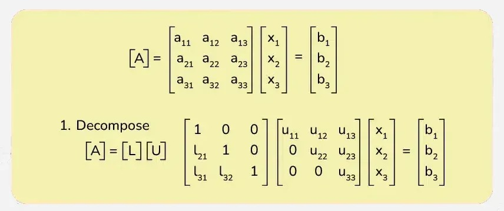

# 2. Résolution systèmes linéaires

On résout $Ax = b, A\in \R^{n.n}, B \in \R^{n}$

Avec $A$ inversible.

2 familles de méthodes :

- **Méthode directes :** On factorise la matrice de façon à se ramener à des sytèmes triangulaires.
- **Méthodes itératives :** on construit ue suite de vecteur $(x^{(k)})$ qui convergent vers la solution.

Critères de choix pour les méthodes :

- Complexité
- Structure de $A$ (creuse..?)
- Précision attendue

## 1. Méthodes directes

### Systèmes triangulaires

$Lx = b, L-l_{ij}$ triangulaire **inférieure**

V $\in ij, l_{ij} = 0$ si $j > i$ (En gros on a des $0$ sur la partie supérieure de la matrice)

$\begin{pmatrix}
1 & 0 & 0\\
1 & 2 & 0\\
1 & 2 & 3
\end{pmatrix}$

#### Ecriture du système

$l_{11}x_1 = b_1$

$l_{21}x_1 + l_{22}x_2 = b_2$

$l_{n1}x_1 + l_{n2}x_2 + ... + l_{nn}x_n = b_n$

Avec :

$x_1 = \frac{b_1}{l_{11}}$

$x_2 = \frac{b_2 - l_{21}x_1}{l_{22}}$

$x_i = \frac{i}{l_{ii}} (b_i - \sum^{i-1}_{j=1} l_{ij}x_j )$

Algorithme de substitution avant (ou descente). (Forward Substitution).

#### Complexité (en fflops)

$n^2$ : opérations arithmétiques

#### Remarques

- On accède à $L$ par ligne

$=>$ Impacte la performance selon le stockage en mémoire.

Pour calculer chaque $x_i$, on a besoin :

- $b_i$
- des $x_j$ précédents

---

$Ux = b, U-u_{ij}$ triangulaire **supérieur**

V $\in ij, l_{ij} = 0$ si $j < i$ (En gros on a des $0$ sur la partie inférieure de la matrice)

$\begin{pmatrix}
1 & 2 & 3\\
0 & 2 & 3\\
0 & 0 & 3
\end{pmatrix}$

$x_i = \frac{i}{u_{ii}} (b_i - \sum^{n}_{j=i+1} u_{ij}x_j )$

#### Complexité (en fflops)

$n^2$ : opérations arithmétiques

### Systèmes linéaires génériques (factorisation LU)

Soit $A \in R^{n.n}$, on décomposant $A$ sous la forme $A = LU$

- Avec $L$ triangulaire **inférieur** avec des $1$ sur la diagonale de $L$
- Avec $U$ triangulaire **supérieure** avec des $1$ sur la diagonale de $U$

On résout $Ax = b$ comme suit :

$Ax = b <=> LUx = b$

On pose $y = Ux$

On résout $Ly = b$, ce qui donne $y$

On résout $Ux = y$, ce qui donne $x$

L'obtention de la factorisatio $A = LU$ se fait par l'élimination de Gauss.

On élimine les inconnus sous la diagonales par des combinaisons linéaires des lignes précédentes.



[documentation](https://www.geeksforgeeks.org/engineering-mathematics/l-u-decomposition-system-linear-equations/)

_Exemple_

$$
A = \begin{pmatrix}
1 & 4 & 7\\
2 & 5 & 8\\
3 & 6 & 10
\end{pmatrix}
$$

On met à $0$ les termes sous la diagonales, colonne par colonne

$$
A = \begin{pmatrix}
1 & 4 & 7\\
2 & 5 & 8\\
3 & 6 & 10
\end{pmatrix}
$$

$$L2 \leftarrow L2 - 2L1$$

$$L3 \leftarrow L3 - 3L1$$

$$
A = \begin{pmatrix}
1 & 4 & 7\\
0 & -3 & -6\\
0 & -6 & -11
\end{pmatrix}
$$

$$L3 \leftarrow L3 - 2L2$$

$$
A = \begin{pmatrix}
1 & 4 & 7\\
0 & -3 & -6\\
0 & 0 & 1
\end{pmatrix} = U
$$

$=>$ Nous avons une matrice **supérieure** triangulaire

$$
L = \begin{pmatrix}
1 & 0 & 0\\
2 & 1 & 0\\
3 & 2 & 1
\end{pmatrix}
$$

Algorithme

Factorisation $LU$ "in place" de $A$ ($L$ et $U$ sont stockés dans $A$).

```pseudocode
for j = 1 : n - 1
    for i = j + 1 : n
        a_ij = a_ij / a_jj

        for k = j + 1 : n
            a_ik = a_ik - a_ij . a_jk
            # de la ligne précédente
        end
    end
end
```

Coût de la factorisation $= \frac{2n^3}{3}$

Coût de la résolution totale $= \frac{2n^3}{3} + 2n^2 = \frac{2n^3}{3}$ Si $n > 1 <=> \theta(n^3)$

### Factorisation $LU$ avec pivotage par permutation des lignes

Problème dans élimination de Gauss

Si $a_{jj} = 0 \rightarrow$ division par 0.

_Exemple_

$
A = \begin{pmatrix}
0 & 1\\
1 & 0\\
\end{pmatrix}
$

Si $a_{jj}$ très petit $\rightarrow$ problèmes numériques

Pour éviter cela on permute les lignes de $A$ (et $B$) desorte que $max|a_{ij}|$ se trouve en position diagonale. Cette technique s'appelle le **pivotage partiel**.

Si ce terme se trouve en position $k$, on permute les lignes $k$ et $j$. A la fin, on obtient la factorisation $PA = LU$, avec $P$ matrice de permutation.

### Rappel

La matrice de permutation $P$ ne contient qu'un seul "1" dans chaque ligne / colonne.

_Exemple_

$A = \begin{pmatrix}
a & c \\
b & d \\
\end{pmatrix}
$

$P = \begin{pmatrix}
0 & 1\\
1 & 0\\
\end{pmatrix}
$

$AP = \begin{pmatrix}
b & d \\
a & c \\
\end{pmatrix}=\begin{pmatrix}
a & c \\
b & d \\
\end{pmatrix}
. \begin{pmatrix}
0 & 1\\
1 & 0\\
\end{pmatrix}
$

On a alors :

$Ax = b$

<=> $PAx = Pb$

<=> $LUx = Pb$

<=> $Ly = Pb \rightarrow y$

<=> $Ux = y \rightarrow x$

_Exemple_

$$
A = \begin{pmatrix}
1 & 4 & 7\\
2 & 5 & 8\\
3 & 6 & 10\\
\end{pmatrix}
$$

On permute $L_1$ et $L_3$

$$
[A|p] = \begin{pmatrix}
3 & 6 & 10 & | & 3\\
2 & 5 & 8 & | & 2 \\
1 & 4 & 7 & | & 1\\
\end{pmatrix}
$$

$L_2 \leftarrow L_2 - \frac{2}{3}L1$

$L_3 \leftarrow L_3 - \frac{1}{3}L1$

$$
[A|p] = \begin{pmatrix}
3 & 6 & 10 & | & 3\\
\frac{2}{3} & 1 & \frac{4}{3} & | & 2 \\
\frac{1}{3} & 2 & \frac{11}{3} & | & 1\\
\end{pmatrix}
$$

On permute $L_2$ et $L_3$

$$
[A|p] = \begin{pmatrix}
3 & 6 & 10 & | & 3 \\
\frac{1}{3} & 1 & \frac{11}{3} & | & 1 \\
\frac{2}{3} & 2 & \frac{4}{3} & | & 2 \\
\end{pmatrix}
$$

$L_3 \leftarrow L_3 - \frac{1}{2}L2$

$$
[A|p] = \begin{pmatrix}
3 & 6 & 10 & | & 3 \\
\frac{1}{3} & 1 & \frac{11}{3} & | & 1 \\
\frac{2}{3} & \frac{1}{2} & -\frac{1}{2} & | & 2 \\
\end{pmatrix}
$$

$U = \begin{pmatrix}
3 & 6 & 10 \\
0 & 2 & \frac{11}{3} \\
0 & 0 & -\frac{1}{2} \\
\end{pmatrix}
$

$L = \begin{pmatrix}
1 & 0 & 0 \\
\frac{1}{3} & 1 & 0 \\
\frac{2}{3} & \frac{1}{2} & 1 \\
\end{pmatrix}
$

$P = \begin{pmatrix}
0 & 0 & 1 \\
1 & 0 & 0 \\
0 & 1 & 0 \\
\end{pmatrix}
$

## 2. Méthodes itératives
