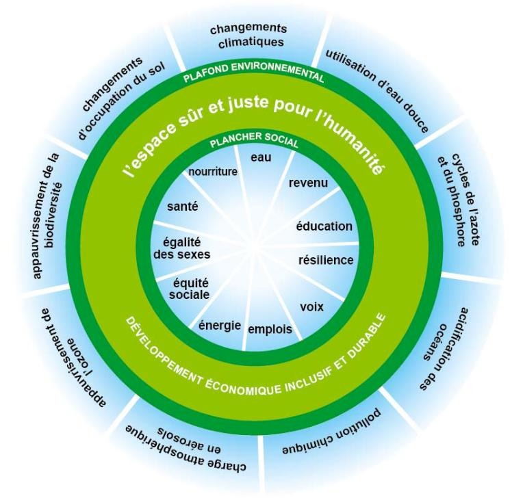

# L'ingénieur face aux enjeux sociétaux I

Pierre TARDIVEAU

## Développement Durable : Objectifs et parties prenantes

- Test sur eCampus
- Auto-formation et entrainement au Polytech pendant _4 mois_
- Evaluation Polytest _(3 juin 2026)_ $=>$ 30 questions + large

### Introduction sur le développement durable et les enjeux planétaires

**Développement durable :** Développement qui répond aux besoins du présent sans compromettre la capacité des générations futures à répondre aux leurs. Il s'appuie sur **trois piliers :**

- économique
- social
- environnemental

**Dans les années 80-90 :**

Le développement durable révolutionne la façon de penser le développement.

Un consensus : Prise en compte de l'environnement, équités intra et inter générationnelle.

**Développement intra-générationnel :** Capacité des générations actuelles à répondre à leurs besoins.

**Développement inter-générationnel :** Capacité des générations futures à répondre à leurs besoins.

#### Protocoles

**Protocole de Kyoto (1997) :** Réduction des émissions de gaz à effet de serre.

**Protocole de Nagoya (2010) :** Conservation de la biodiversité.

**L'empreinte écologique :** est un indicateur mesurant les surfaces alimentaires productives de terres et d'eau nécessaire pour produirex les ressources d'un individu, une population, ou une activité.

**Indice du développement humain :** est un indice statistique composite mesurant le taux de développement humain des pays du monde. Il se fonde sur 3 critères :

- PIB par habitant
- Espérance de vie à la naissance
- Niveau d'éducation des enfants de 17 ans et +

#### Limites planétaires

7 ont été franchies.

#### Faim dans le monde

La faim dans le monde a fortement diminué depuis 1970, elle est désormais à $8$% de la population mondiale, alors que $30$% de l'alimentation mondiale est gaspillée.

#### Ressources fossiles

- Charbon
- Pétrole
- Gaz naturel

Tous les minerais sont fossiles.

**Ressources abiotiques :** fossiles, miné&raux, métaux, qui sont en stock limité

### Objectifs de développement durable et rôle de l'ingénieur

## Energie : transition et sobriété (mardi 27 janvier)

- Evaluation écrite _(25 mars)_
- Soutenance orale de projet Bilan Carbone _(3 juin)_

### Energies

**Energie :** est la grandeur physique qui permet de caractériser une transformation de la matière dans un système.

L'énergie se conserve (loi fondamentale de la physique).

L'humanité a commencer à utiliser massivement les énergies fossiles depuis la **révolution industrielle**.

La part des énergies fossiles dans les énergies primaires consommées deans le monde est d'environ $80$%.

## Enjeux liés au climat et à l'énergie

## Fresque du Climat et Ateliers Shift Project

## Bilan Carbone - Approche théorique et pratique

## Atelier 2 tonnes

## Transition sobriété énergétique
