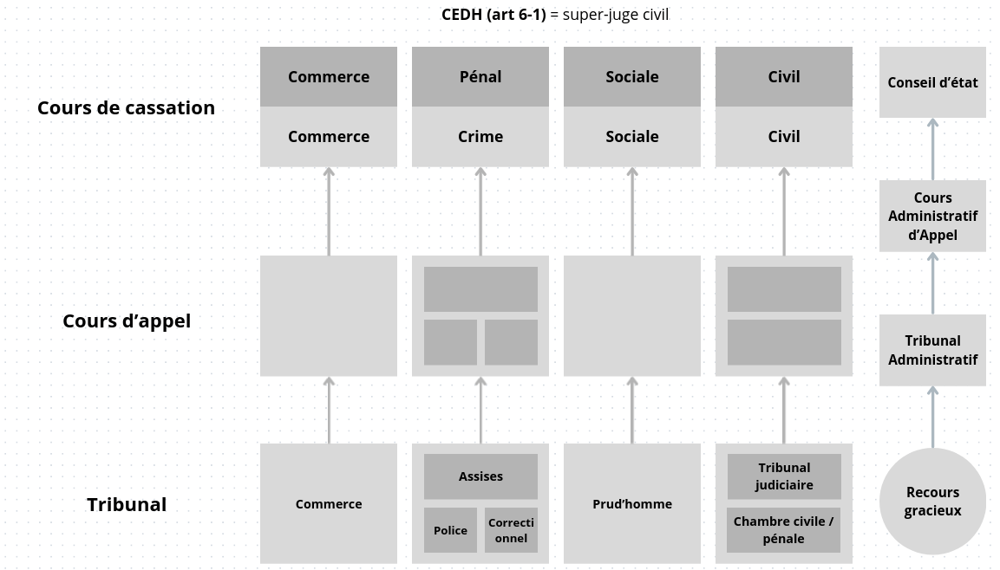

# Séance 1

## Constitutions

- $V^{eme}$ République (1958 - ...)

  - Introduction de la cohabitation

- $IV^{eme}$ République (1946 - 1958)

## Pyramide

_(du haut vers le bas)_

- Bloc de constitutionnalité

  - Constitutions (V, IV)
  - DDHC (1789)
  - Le peuple souverain décide de la Constitution (nous)

- Droit international

  - Général
    - ...
    - Etats souverains
  - Spécials
    - Traités
    - Dérivés (directives communautaires, libre circulation)

- Lois organiques **LEGISLATIF**

  - Lois qui pourraient être constitutionnelles (mais qui ne le sont pas)

- Lois ordinaires **LEGISLATIF**

  - Lois votées par le Parlement

- Droit réglementaire **EXECUTIF**

  - Décrets d'applications (acte administratif qui précise les conditions d'application d'une loi)

- Jurisprudence **JUDICIAIRE**

  - Interprétation des lois par le juge

- Coutume
  - Usages qui sont suivis, en l'absence de loi
  - Pas de lois spécifiques
  - Utilisations ininterrompues
    - Tauromachie

---

**Principe de faveur :** Consiste à appliquer aux salariés la règle de droit qui lui est la plus favorable.

**Loi El Khomri :** Si il y a un accord d'entreprise, alors on applique pas le principe de faveur, mais l'accord d'entreprise prime sur l'accord de branche.

Exemple de saisi en cas de préjudice :

## Contrat de travail

**Théorie générale du contrat :**

- Rémunération
- Activité menant à une rémunération
- Lien de subordination juridique (accepter de perdre une partie de sa liberté pour réaliser une mission)

**Conditions de validité du contrat :**

- Consentement
- Objet
- Capacité juridique
- Cause
- (Bonne foi)

**Couples de contrats :**

- Obligations de moyen et/ou de résultat
- Contrat unilatéral
  - **A** s'engage à faire quelque chose pour **B**, et **B** n'a rien à faire pour **A**. _(ex. donation, héritage)_. $A => B$
- Contrat **Synallagmatique** (réciproque ou bilatéral) :
  - **A** s'engage à faire quelque chose pour **B**, et **B** s'engage à faire quelque chose pour **A**. _(ex. contrat de travail, vente)_. $A <=> B$
- Contrat instantané
  - Contrat qui se réalise en une fois. _(ex. achat d'un bien)_
