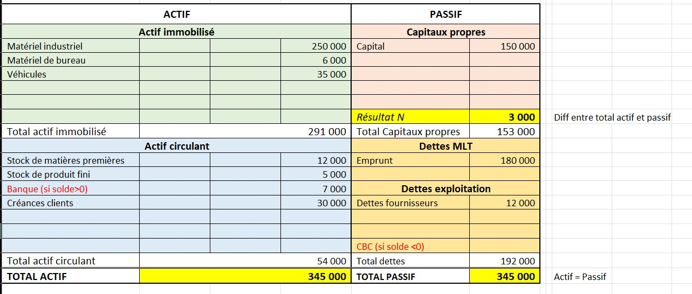
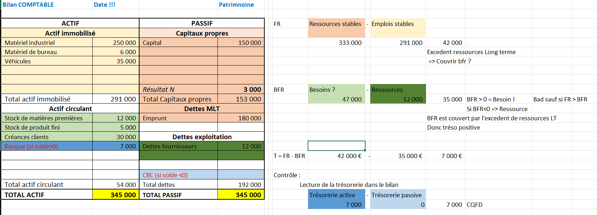
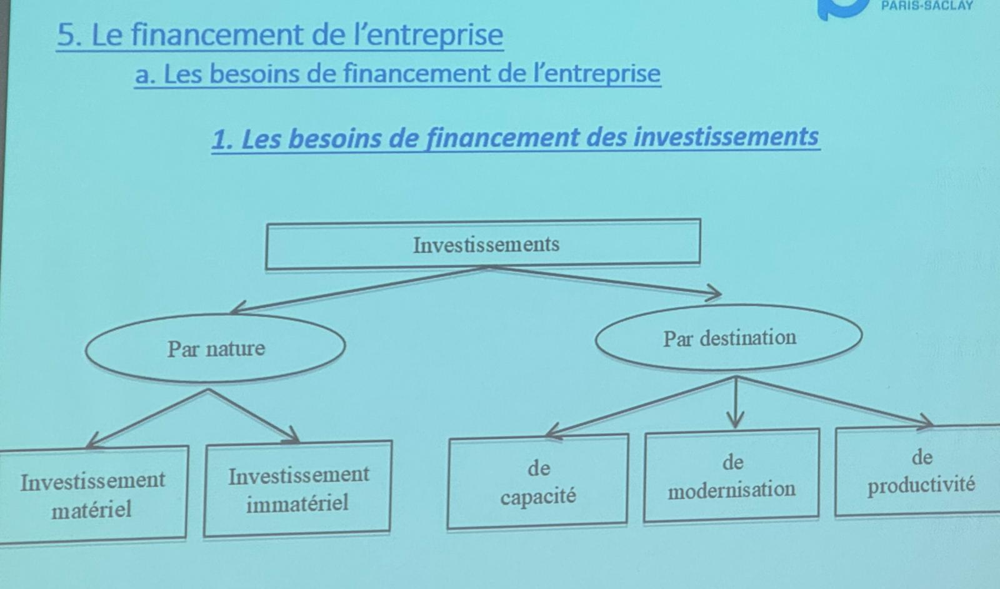

# Diagnostic interne

## La fonction commerciale

Le marketing, c'est se poser **4 questions** :

- Identifier le marché $=>$ Études de marché
- Savoir où en sont ses **P**roduits ? $=>$ Cycle de vie
  - Avoir prévu le remplacement des "vieux" $=>$ _Matrice BCG_
- Définir le **P**rix
- Mettre en **P**lace la stratégie de vente - **P**romotion

Pour chacunes de ces questions $=$ différents outils

**DAS** : Domaine d'Activité Stratégique

### Directeur produit

Rôles d'un directeur produit :

- Identifier le marché
- Etudes de marché
- Connaitre les consommateurs
- Connaitre l'environnement, la technologie, la réglementation
- Connaitre les autres intervenants : distributeurs, guides d'opinion ?
- Connaitre la concurrence

### Méthodologie matrice BCG

(_Boston consulting group_) $=>$ **outil d'analyse stratégique**

Analyser le **portefeuille de produits** d'une entreprise , **dans un secteur d'activité**, selon 2 critères :

- Taux de croissance du marché
- Part de marché relative de l'entreprise

Les **4 catégories** de la matrice BCG :

- **📈📈 Vedettes :** fort part de marché sur un marche en forte croissance.
- **📈📉 Vaches à lait :** fort part de marché, sur un marché à faible croissance.
- **📉📈 Dilemmes :** faible part de marché, sur un marché à forte croissance. _(investir pour le développer / abandon)_
- **📉📉 Poids mort :** faible part de marché, sur un marché à faible croissance. _(abandon)_

**Positionnement :**

|            |               |
| ---------- | ------------- |
| Dilemmes   | Etoiles       |
| Poids mort | Vaches à lait |

**Placement dans la matrice :**

Pour placer un produit dans la matrice BCG, on calcule la part de marché relative :

- Taux du croissance du marché (ordonnée)
- Part de marché de l'entreprise (abscisse)

_Ex : Taux de croissance du marché des boissons sucrées **vs** Part de marché de Coca-Cola_

## Le marketing opérationnel

### La politique de prix

- Stratégie de prix
  - Stratégie de pénétration
  - Stratégie d'alignement
  - Stratégie d'écrémage

- Politique de prix
  - Tarification unique
  - Tarification différenciée
  - Yield Management _(gestion du rendement)_
  - Politique forfaitaire
  - Gratuité

## Production

Ensemble des activités et des opérations :

- Bureau des études _(conception)_
- Bureau des méthodes _(calculer des coûts)_
- Ordonnancement _(quels rythmes ? quelles quantités ? à quelle dates ?)_
- Lancement production _(transformation des ressources)_
- Tracabilité _(suivi des produits, qualités)_

La performance de l'entreprise **passe par la satisfaction du client** : enjeu de la qualité.

### Gestion de qualité

**La qualité totale** : démarche d'amélioration continue de la qualité dans tous les services de l'entreprise.

De nombreux outils pour :

- Analyser la performance
- Analyser le fonctionnement (PERT)

**Sécurisation des processus** $=$ _AMDEC_ : **A**nalyse des **M**odes de **D**éfaillances, de leurs **E**ffets et de leur **C**riticité

### Gestion de production

Analyse des coûts

- **Comptabilité générale :** _Produire un compte de résultat (performance), bilan (patrimoine) et annexe (ce qu'on a fait)_
- **Comptabilité analytique :** _Comptabilité de gestion_

Comptabilité analytique

- Définir les centres d'analyse _(étape de la production)_ - emboutissage / montage / peinture / etc.
- Répertorier les charges fixes et variables, directes et indirectes
- Déterminer les clés de répartition des charges indirectes

## Logistique

### Gestion des achats

Fonctions achats :

- Connaître le marché en amont
- Exprimer les besoins
- Provoquer l'offre
- Evaluer et sélectionner les fournisseurs
- Négocier avec les fournisseurs
- Commander
- Assurer le suivi et la réception des commandes

### Gestion des stocks

**Eviter la rupture de stock :** handicapant pour la clientèle

**Trop de stock :** immobilisation financière et coût de stockage

Le stock permet de :

- Réguler (éviter sur-stockage et sous-stockage)
- Spéculer les stocks disponibles dans certains domaines (or, pétrole, etc.)
- Rôle commercial
- Rôle technique (améliorer la qualité des produits)
- Rôle économique

3 grandes questions du **rôle économique** :

- Commander tous les combien ?
- A quelle date ? Quelle quantité ? Quelle qualité ? Quel coût ?
- Combien "vaut" le stock ? _(métier du contrôleur de stock)_

## Financement de l'entreprise

### Patrimoines de l'entreprise

### Bilan

- Actif _(tout ce que je possède)_
  - Actif immobilisé _(LT)_
    - Outils de production
    - Matériels
    - Brevets
    - Fonds de commerce
  - Actif circulant _(MT & CT)_
    - Créances clients
    - Trésorerie (disponibilités)
      - Compte bancaire (scriptural)
      - Caisse (espèces)
    - Stocks
- Passif _(tout ce que je dois)_
  - Capitaux propres _(LT)_
    - Capital social
    - Autofinancement _(dégagement du bénéfices, pour projets / machines, etc.)_
  - Dettes _(MT & CT)_
    - Dettes fournisseurs
    - Emprunts bancaires
    - Concours bancaires courant (découvert)

### Compte de résultat

On dit dans un compte de résultat, que les **charges et produits** sont classés par **nature**.

- Exploitation financier _(exploitation)_
- Exceptionnel _(évènements exceptionnels)_

### Analyse financière

**Analyse financière :** L'étude de la santé financière d'une entreprise. Comprendre comment est réparti son patrimoine, et quelles sont ses méthodes de financements.

#### Indicateurs

- **Fond de Roulement Net Global _(FRNG)_ :** Ressources dont dispose une entreprise à long terme _(Passifs permanents - Actifs permanents)_
- **Besoin en Fonds de Roulement _(BFR)_ :** Fonds nécessaire à une entreprise pour financer son exploitation _((Stocks + créances) - dettes circulantes)_
- **Trésorerie nette _(TN)_ :** Liquidités financières disponibles à court terme _(Fond de roulement - Besoin en fonds de roulement)_

On analyse le **bilan** de l'entreprise _(cf. Annexe 4 polycopié)_

#### $FR = FRNG =$ Ressources stables - Emplois stables

- Ressources stables : $330000$ _(Capitaux propres + Dettes MLT)_
- Emplois stables : $291000$ _(Actif immobilisé)_

$ => FR = 330000 - 291000 = 42000$

Excedent ressources LT $=>$ couvrir BFR ?

#### $BFR =$ Besoins - Ressources

- Besoins ? : $47000$ _(stocks et créances)_
- Ressources ? : $12000$ _(Dettes exploitation)_

$ => BFR = 47000 - 12000 = 35000$

$BFR > 0 =$ Besoin !! _(Mauvais sauf si $FR$ > $BFR$)_

$BFR < 0 =$ Ressources

$BFR$ est couvert par l'excedent des ressources LT

#### $T = FR - BFR$

$ => T = 42000 - 35000 = 7000$

#### Lecture de la trésorerie : Trésorerie active - Trésorerie passive

- Trésorerie active : $7000$ _(Banque)_
- Trésorerie passive : $0$ _(Concours bancaires courant)_

$ => T = 7000 - 0 = 7000$

### Besoin de financement des investissements

Divisé en **3 catégories :**

- Investissements matériels
- Investissements incorporels
- Investissements financiers

Par destination

- **Capacité :** Diversification / Internationalisation
- **Modernisation :** Nouvelle tech et amélioration
- **Productivité :** Changement de machines / Formations / Production accrue $=>$ Domination par les coûts

#### Sources de financement

- Capital social
- Autofinancement
- Emprunts bancaires
- Crédit-bail _(contrat de location avec option d'achat)_

### Besoin de financement de l'exploitation

- Stocks
- Créances clients
- Dettes

#### Sources de financement

- Capitaux permanents : le fond de roulement
- Des dettes à court terme : dettes fournisseurs, concours bancaires courants
- L'affacturage
  - Vente des créances clients à un établissement financier _(Factor)_
- Escompte commercial : avance de sommes dues par la banque. ⚠️ A faire sur créances fiables

### La fonction des ressources humaines

#### Gestion prévisionnelle des emplois et des compétences _(GPEC)_

Elle permet à une entreprise de **prévoir et anticiper**, et améliorer la QVCT _(Qualité de Vie au Travail)_ :

- Quels emplois aura-t-elle besoin demain ?
- Quelles compétences seront nécessaires ?
- Quelles formations seront nécessaires ?

La notion de **compétences**

- Le savoir _(connaissances théoriques)_
- Le savoir-faire _(expériences pratiques)_
- Le savoir-être _(rigueur, communication)_

La démarche **GPEC**

- Diagnostic : _identifier les compétences, points forts et fragilités_
- Analyse des écarts : _besoins vs ressources_
- Plan d'action : _recrutement, formation, mobilité_

**Enjeux** stratégiques

- Accompagner les évolutions digitales
- Anticiper la pyramide des ages
- Gérer les effectifs de façon prospective
- Renouveler le management

Gestion de **carrières et mobilité**

- Mobilité verticale : _promotion, évolution hiérarchique_
- Mobilité horizontale : _changement de poste au même niveau_
- Mobilité géographique : _changement de site ou d'établissement_

La **GPEC** n'est pas seulement un outil RH, mais c'est un **levier de performance**.

Elle permet d'**anticiper les besoins futurs** de l'organisation, tout en répondant aux **aspirations des salariés**.

**Clé du succès :** un dialogue constant entre direction et salariés.

#### RSE et éthique d'entreprise

Démarches

- Environnemental : _agir pour le climat et la transition vers une économie bas-carbone_
- Social : _renforcer la cohésion et l'inclusion sociale_
- Sociétal : _agir en faveur des territoires et des communautés_

## Annexes

_Diagramme d'Ishikawa pour la recherche et les causes de défauts_

_AMDEC : Analyse des Modes de Défaillances, de leurs Effets et de leur Criticité_

_PERT_

