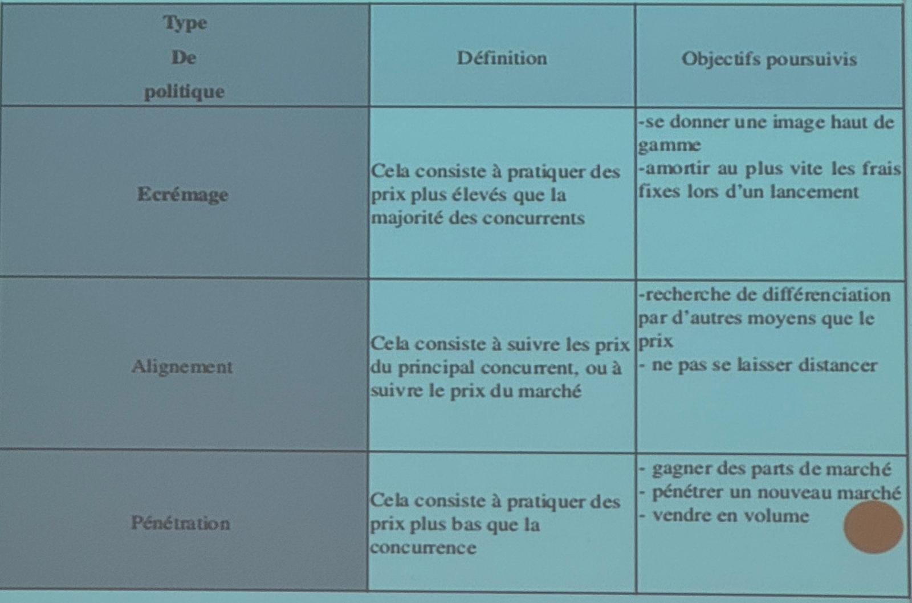
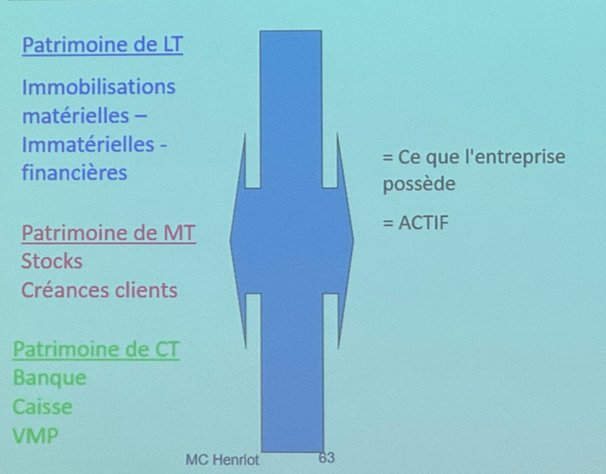
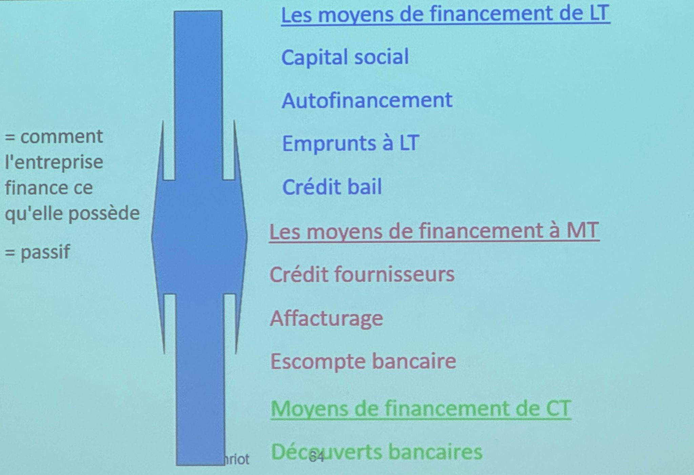
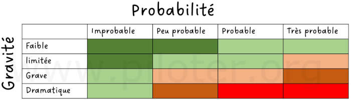
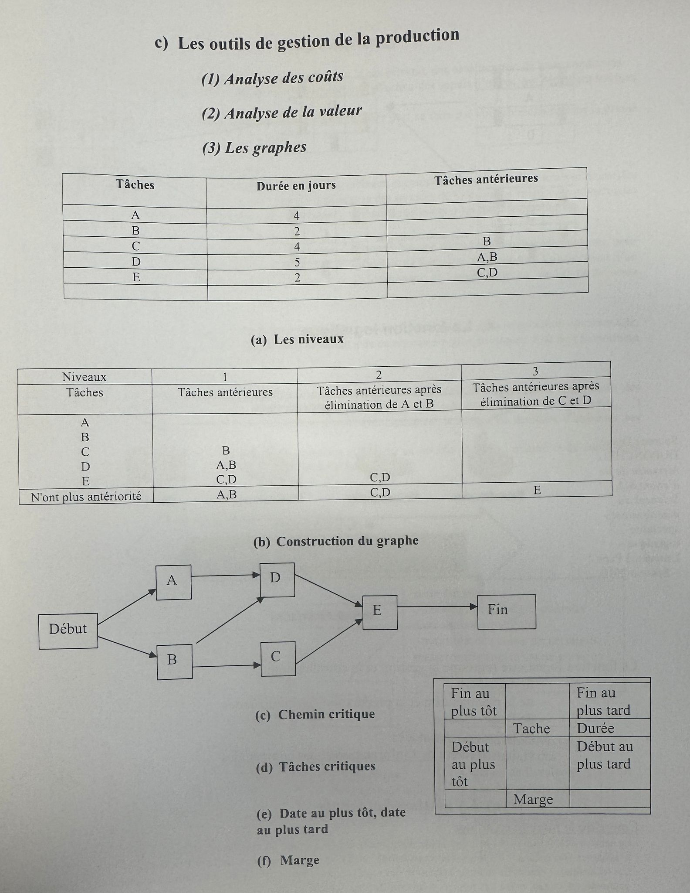
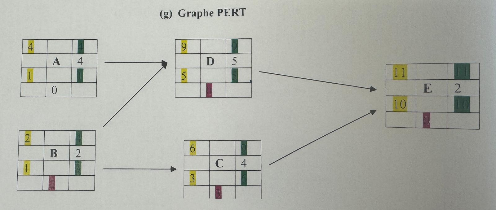

# Diagnostic interne

## La fonction commerciale

Le marketing, c'est se poser **4 questions** :

- Identifier le marché $=>$ Études de marché
- Savoir où en sont ses **P**roduits ? $=>$ Cycle de vie
  - Avoir prévu le remplacement des "vieux" $=>$ _Matrice BCG_
- Définir le **P**rix
- Mettre en **P**lace la stratégie de vente - **P**romotion

Pour chacunes de ces questions $=$ différents outils

**DAS** : Domaine d'Activité Stratégique

### Directeur produit

Rôles d'un directeur produit :

- Identifier le marché
- Etudes de marché
- Connaitre les consommateurs
- Connaitre l'environnement, la technologie, la réglementation
- Connaitre les autres intervenants : distributeurs, guides d'opinion ?
- Connaitre la concurrence

### Méthodologie matrice BCG

(_Boston consulting group_) $=>$ **outil d'analyse stratégique**

Analyser le **portefeuille de produits** d'une entreprise , **dans un secteur d'activité**, selon 2 critères :

- Taux de croissance du marché
- Part de marché relative de l'entreprise

Les **4 catégories** de la matrice BCG :

- **📈📈 Vedettes :** fort part de marché sur un marche en forte croissance.
- **📈📉 Vaches à lait :** fort part de marché, sur un marché à faible croissance.
- **📉📈 Dilemmes :** faible part de marché, sur un marché à forte croissance. _(investir pour le développer / abandon)_
- **📉📉 Poids mort :** faible part de marché, sur un marché à faible croissance. _(abandon)_

**Positionnement :**

|            |               |
| ---------- | ------------- |
| Dilemmes   | Etoiles       |
| Poids mort | Vaches à lait |

**Placement dans la matrice :**

Pour placer un produit dans la matrice BCG, on calcule la part de marché relative :

- Taux du croissance du marché (ordonnée)
- Part de marché de l'entreprise (abscisse)

_Ex : Taux de croissance du marché des boissons sucrées **vs** Part de marché de Coca-Cola_

## Le marketing opérationnel

### La politique de prix

- Stratégie de prix
  - Stratégie de pénétration
  - Stratégie d'alignement
  - Stratégie d'écrémage

- Politique de prix
  - Tarification unique
  - Tarification différenciée
  - Yield Management _(gestion du rendement)_
  - Politique forfaitaire
  - Gratuité

## Production

Ensemble des activités et des opérations :

- Bureau des études _(conception)_
- Bureau des méthodes _(calculer des coûts)_
- Ordonnancement _(quels rythmes ? quelles quantités ? à quelle dates ?)_
- Lancement production _(transformation des ressources)_
- Tracabilité _(suivi des produits, qualités)_

La performance de l'entreprise **passe par la satisfaction du client** : enjeu de la qualité.

### Gestion de qualité

**La qualité totale** : démarche d'amélioration continue de la qualité dans tous les services de l'entreprise.

De nombreux outils pour :

- Analyser la performance
- Analyser le fonctionnement (PERT)

**Sécurisation des processus** $=$ _AMDEC_ : **A**nalyse des **M**odes de **D**éfaillances, de leurs **E**ffets et de leur **C**riticité

### Gestion de production

Analyse des coûts

- **Comptabilité générale :** _Produire un compte de résultat (performance), bilan (patrimoine) et annexe (ce qu'on a fait)_
- **Comptabilité analytique :** _Comptabilité de gestion_

Comptabilité analytique

- Définir les centres d'analyse _(étape de la production)_ - emboutissage / montage / peinture / etc.
- Répertorier les charges fixes et variables, directes et indirectes
- Déterminer les clés de répartition des charges indirectes

## Logistique

### Gestion des achats

Fonctions achats :

- Connaître le marché en amont
- Exprimer les besoins
- Provoquer l'offre
- Evaluer et sélectionner les fournisseurs
- Négocier avec les fournisseurs
- Commander
- Assurer le suivi et la réception des commandes

### Gestion des stocks

**Eviter la rupture de stock :** handicapant pour la clientèle

**Trop de stock :** immobilisation financière et coût de stockage

Le stock permet de :

- Réguler (éviter sur-stockage et sous-stockage)
- Spéculer les stocks disponibles dans certains domaines (or, pétrole, etc.)
- Rôle commercial
- Rôle technique (améliorer la qualité des produits)
- Rôle économique

3 grandes questions du **rôle économique** :

- Commander tous les combien ?
- A quelle date ? Quelle quantité ? Quelle qualité ? Quel coût ?
- Combien "vaut" le stock ? _(métier du contrôleur de stock)_

## Financement de l'entreprise

### Patrimoines de l'entreprise

## Annexes

_Diagramme d'Ishikawa pour la recherche et les causes de défauts_

_AMDEC : Analyse des Modes de Défaillances, de leurs Effets et de leur Criticité_

_PERT_

