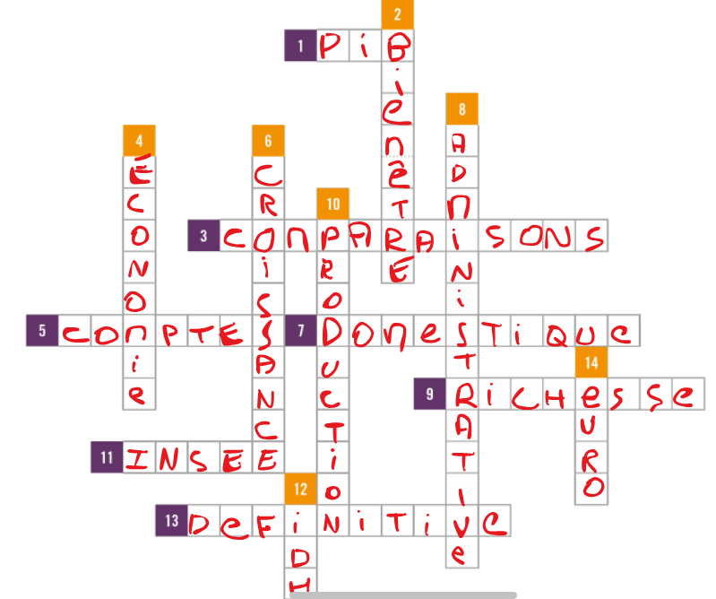

# Résumé annexe $1$ :

### Définitions

_Croissance économique :_ Evolution de la richesse produite sur le territoire français entre deux trimestres (ou deux années consécutives). Cette richesseé est appelé le Produit Intérieur Brut (PIB).

_PIB :_ Somme des valeurs ajoutées (VA), des producteurs résidant sur son territoire. C'est la richesse créée par les activités de production.

Si la production fluctue, cela peut être dû à 2 facteurs : 

- Evolution du prix (inflation, déflation)
- Evolution du volume produit

**- C'est souvent un peu des 2 -**

**2015 :** $2200$ milliards d'euros et $+1.3$% de croissance

### Croissance

On mesure la croissance par l'évolution du PIB déduction faite de l'évolution des prix. 

Le PIB en volume est égal au PIB en valeur diminué de l'impact de l'évolution des prix sur la période considérée.

### INSEE - Institut National de la Statistique et des Études Économiques

La mesure du PIB obéit à des règles internationales. Les méthodes de calcul sont définies par l'**Organisation des nations unies (ONU)**, et sont les mêmes pour tous les pays.

L'INSEE calcule le PIB, fourni ce chiffre, ainsi que d'autres indicateurs pour le décrire, par exemple :

- Pouvoir d'achat des ménages
- Marges des entreprises
- Dettes des administrations publiques

Environ 80 personnes chez l'INSEE travaillent sur l'élaboration du calcul du PIB, mais d'autres administrations et organismes publics participent : 

- Direction générale des finances publiques
- Banque de France
- Services statistiques ministériels

Il faut environ **3 ans** pour affiner le calcul du PIB d'une année donnée, après des enquêtes auprès des entreprises et des données administratives.

## Quels informations pour mesurer le PIB ?

- **Sources administratives :** déclarations des entreprises, statistiques douanières, les comptes des administrations publiques, etc.
- **Enquêtes conjoncturelles :** consommation, production, prix, etc.

La précision du calcul de la mesure de la croissance annuelle est de l'ordre de *$\pm0.2$* point. 

On calcul le PIB depuis environ le **XVIIIe siècle (18ème)**.

Le PIB inclut même les activités "souterraines", via les contrôles fiscaux. (ex. $3.7$% du PIB en $2008$) 

### PIB - A quoi ça sert ?

- Suivre l'état de santé de l'économie, et de mesurer l'évolution de l'activité économique. Il permet notamment d'adapter la politique économique. 
- Ces politiques permettent notamment à déterminer les moyens dont dispose l'Etat pour financer les dépenses publiques. 
- Enfin cela aide également les entreprises à mieux connaître le contexte économique, et ainsi guider leurs choix d'investissement.

### PIB et les autres

#### Union Européenne

Le PIB détermine les **contributions financières au budget de l'Union Européenne (UE)**, versées par les Etats membres. Cela permet d'ajuster les aides accordées aux différents territoires.

#### Monde

Le PIB des pays permet de comparer la puissance économique des pays entre eux.

On peut également comparer **le PIB par habitant** (PIB divisé par le nombre d'habitants) pour avoir une idée du niveau de vie moyen dans chaque pays.

France : $30000$€ par habitant

- $>50000$€ pays riches (Luxembourg, Qatar)
- $1000$€$<$ pays pauvres

### Limites du PIB

Il représente **uniquement** la valeurs des échanges économiques.

Le PIB ne prend pas en compte :
- Evolution des valeurs boursières
- Activités bénévoles ou domestiques (gateau "fait-maison" $\neq$ gateau acheté en magasin ou jardinage par un professionnel $\neq$ jardinage par soi-même)

$=$ Le PIB ne reflète ni la nature de l'activité économique ni son impact environnemental.

Il ne mesure pas non plus la **qualité de vie de la population.**

### Indicateurs complémentaires

Pour prendre en compte la qualité de vie, on utilise d'autres indicateurs :
- **Emissions de CO2** : des activités de productions
- **Inégalités des patrimoines** : selon les catégories
- **Indice de développement durable** : prend en compte des critères économiques, sociaux et environnementaux.
- **Indice de développement humain (IDH)** : proposés par l'ONU : 
    - Espérance de vie à la naissance
    - Niveau d'éducation
    - Revenu par habitant

## Mots fléchés

